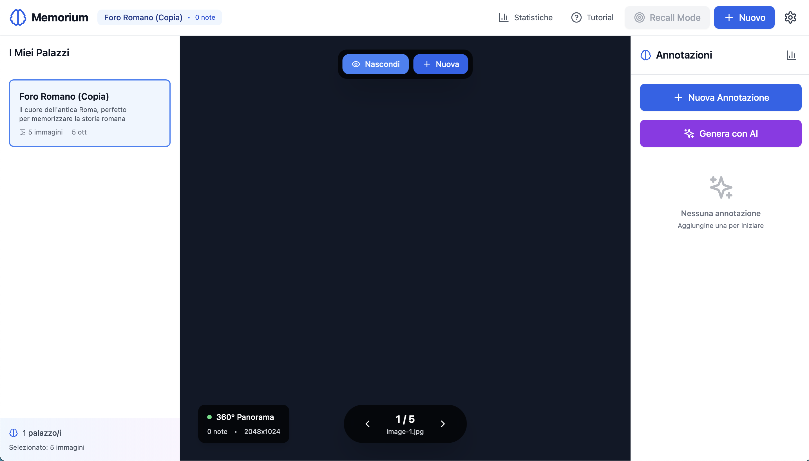

# 🧠 Memorium - Digital Memory Palace

> Transform your notes into vivid mental images using the ancient Method of Loci technique, powered by AI.

[](https://memorium-v2.vercel.app)
[](LICENSE)
[](https://nextjs.org/)
[](https://www.typescriptlang.org/)



## ✨ Features

- **🏛️ 360° Memory Palaces**: Upload panoramic photos of your spaces (home, office, landmarks)
- **📍 Interactive Annotations**: Place notes directly in 3D space with visual markers
- **🎯 Active Recall Mode**: Test your memory with built-in spaced repetition
- **🤖 AI-Powered Generation**: Auto-generate visual mnemonics from your text (optional)
- **📊 Progress Tracking**: Monitor your recall accuracy and improvement over time
- **🔒 Privacy First**: All data stored locally in your browser (IndexedDB)
- **📱 Progressive Web App**: Install and use offline on any device
- **🌐 No Account Required**: Start immediately, no registration needed

## 🎯 Why Memory Palaces?

The Method of Loci (Memory Palace technique) is **10x more effective** than traditional memorization:

- Used by **memory champions** to remember thousands of items
- Based on **spatial memory** (your strongest memory type)
- Backed by **2000+ years** of proven results
- Perfect for: exams, presentations, languages, facts, lists, speeches

## 🚀 Quick Start

### Online (Recommended)

Visit [memorium-v2.vercel.app](https://memorium-v2.vercel.app) and start immediately!

### Local Development

```bash
# Clone repository
git clone https://github.com/yourusername/memorium-v2.git
cd memorium-v2

# Install dependencies
npm install

# Run development server
npm run dev

# Open http://localhost:3001
```

## 📖 How to Use

### 1️⃣ Create Your First Palace

- Upload 360° photos (use Google Street View app)
- Or use regular photos of familiar places
- Import standard palaces from the gallery

### 2️⃣ Add Annotations

- Click in the 3D viewer to place notes
- Add text, images, and vivid descriptions
- Use AI to generate mnemonics (optional)

### 3️⃣ Explore & Study

- Navigate through your palace in 3D
- Review all annotations in context
- Use spatial memory naturally

### 4️⃣ Test with Recall Mode

- Active recall strengthens memory
- Get instant feedback
- Track progress over time

## 🛠️ Tech Stack

- **Framework**: Next.js 14 (App Router)
- **Language**: TypeScript
- **UI**: Tailwind CSS
- **3D**: Three.js + React Three Fiber
- **State**: Zustand
- **Storage**: IndexedDB (Dexie)
- **Icons**: Lucide React
- **AI**: OpenAI GPT-4 (optional, BYO API key)

## 📁 Project Structure

```
memorium-v2/
├── components/          # React components
│   ├── annotations/    # Annotation system
│   ├── palace/         # Palace viewer & management
│   └── ui/            # Reusable UI components
├── lib/               # Business logic
│   ├── store.ts       # Zustand state management
│   ├── imageDB.ts     # IndexedDB wrapper
│   ├── aiGenerator.ts # OpenAI integration
│   └── security.ts    # Encryption utilities
├── pages/             # Next.js pages
│   ├── index.tsx      # Landing page
│   └── userhome.tsx   # Main app
├── public/            # Static assets
└── types/             # TypeScript definitions
```

## 🔐 Privacy & Security

- **100% Local Storage**: Data never leaves your browser
- **Optional Encryption**: AES-256 encryption for sensitive data
- **No Tracking**: Zero analytics or tracking scripts
- **Open Source**: Audit the code yourself

## 🌐 PWA Features

- **Offline Support**: Works without internet after first load
- **Install Anywhere**: Add to home screen (mobile/desktop)
- **Fast Loading**: Service worker caching
- **Push Notifications**: Reminder support (coming soon)

## 🤝 Contributing

Contributions are welcome! Please follow these steps:

1. **Fork** the repository
2. **Create** a feature branch (`git checkout -b feature/amazing-feature`)
3. **Commit** your changes (`git commit -m 'Add amazing feature'`)
4. **Push** to the branch (`git push origin feature/amazing-feature`)
5. **Open** a Pull Request

### Development Guidelines

- Follow existing code style (TypeScript + ESLint)
- Add tests for new features
- Update documentation
- Keep commits atomic and descriptive

## 📝 Roadmap

- [x] 360° Image Support
- [x] Active Recall Mode
- [x] AI Generation
- [x] Progress Tracking
- [ ] Spaced Repetition Algorithm (SRS)
- [ ] Export/Import Palaces
- [ ] Collaborative Palaces
- [ ] Mobile App (React Native)
- [ ] Voice Notes
- [ ] AR Mode

## 📄 License

This project is licensed under the MIT License - see the [LICENSE](LICENSE) file for details.

## 🙏 Acknowledgments

- Inspired by the ancient [Method of Loci](https://en.wikipedia.org/wiki/Method_of_loci)
- Built with amazing open-source libraries
- Icons by [Lucide](https://lucide.dev/)

## 📧 Contact

- **Email**: memorium.ai@gmail.com
- **Issues**: [GitHub Issues](https://github.com/yourusername/memorium-v2/issues)
- **Discussions**: [GitHub Discussions](https://github.com/yourusername/memorium-v2/discussions)

## 🌟 Support

If you find this project useful:

- ⭐ Star the repository
- 🐛 Report bugs
- 💡 Suggest features
- 🔀 Submit pull requests

---

Made with 🧠 by [Your Name]

**Remember better. Learn faster. Never forget.**